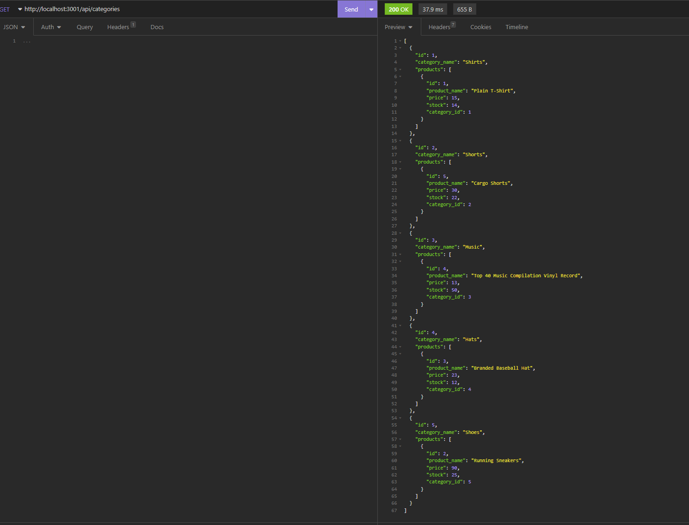

# Challenge 13: Ecommerce_Backend

## Description 

To develop a back end process for an e-commerce website using Express.js API and Sequelize interactions with MySQL database.

## User Story

AS A manager at an internet retail company
I WANT a back end for my e-commerce website that uses the latest technologies
SO THAT my company can compete with other e-commerce companies

## Acceptance Criteria

GIVEN a functional Express.js API
WHEN I add my database name, MySQL username, and MySQL password to an environment variable file
THEN I am able to connect to a database using Sequelize
WHEN I enter schema and seed commands
THEN a development database is created and is seeded with test data
WHEN I enter the command to invoke the application
THEN my server is started and the Sequelize models are synced to the MySQL database
WHEN I open API GET routes in Insomnia for categories, products, or tags
THEN the data for each of these routes is displayed in a formatted JSON
WHEN I test API POST, PUT, and DELETE routes in Insomnia
THEN I am able to successfully create, update, and delete data in my database

## INSTALLATION 

User will need to install dotenv, express, mysql2, and sequelize. To install go to terminal and do npm i to run all needed applications. 

### Required Modules / Packages:

* Node.js
* mysql2 Package
* dotenv Package

## USAGE 

The following screenshots show examples of the interaction and options presented to the user when application is initiated. 

## STEPS for USAGE

Database creation in Workbench:

Tables created by using following command in terminal: 

After running all seed files, run the following command: 

The images below shows some examples of the various commands and outputs using insomnia:

Category - All

Product - All

Tag - All

Category - By Id

Product - By Id

Tag - By Id

Using Insomina a folder structure was created to run through all the different commands as needed for creating, updated, and deleting as well as seeing updates through each stage. 

A video recording goes through all the steps to show how to obtain all the various table information. 

Link found below in the link section. 

## LINKS 

Link to GitHub:

[GitHub Documentation](https://github.com/TrianaD/ecommerce_backend)

Link to video example: 

[Video Example](https://drive.google.com/file/d/12mhHXm0fhslU-ZczGuAo5Gfqhbd-aJcJ/view)

